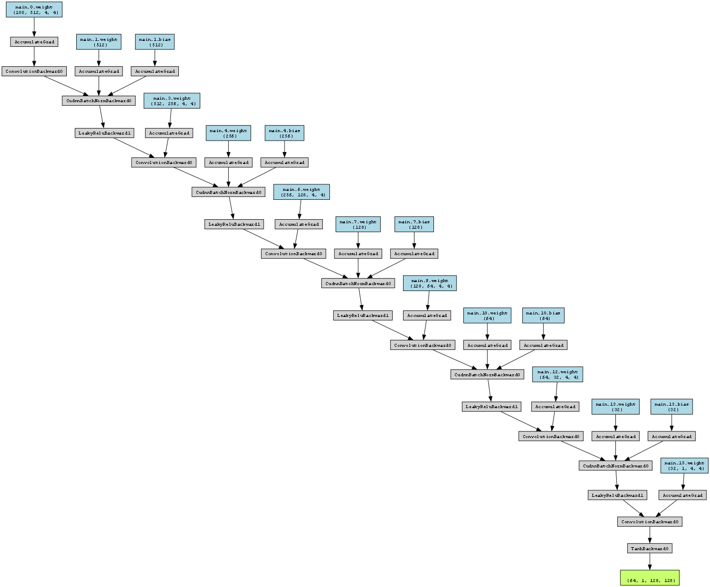
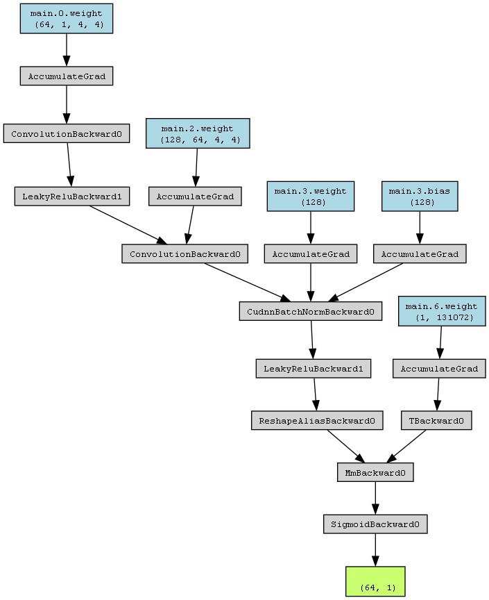
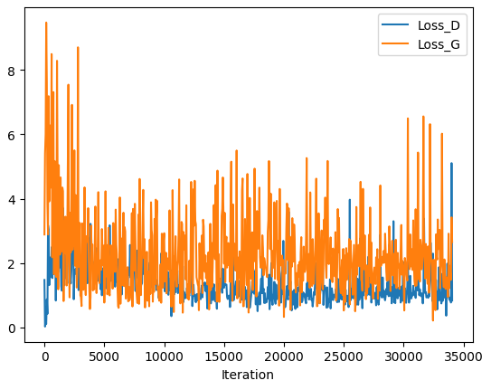
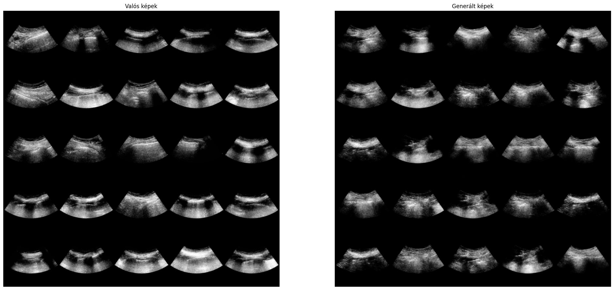

# DL8TQ2 Diagnosztikai célú orvosi képalkotás - féléves feladat
Szerző: Szabó Róbert Zsolt, Óbudai Egyetem (2023)

## Bevezetés
Neurális hálók orvosi diagnosztikai célú képeken történő alkalmazásának egyik legnagyobb gátja az általában szűkös adatmennyiség. Ennek oka, hogy egyrészt valós betegekről készült felvételek kevésbé könnyen elérhetőek a természetes képeknél, másrészt pedig a gyűjtött képek annotálásához leggyakrabban tapasztalt szakorvosokra van szükség. A problémát általában a meglévő adatok feljavításával lehet valamennyire kiküszöbölni, aminek egyik módja lehet az adathalmaz szintetikus képekkel történő dúsítása, szintetikus annotációkkal együtt.
A projekt célja egy generatív neurális hálózat betanítása szintetikus tüdő ultrahang képek előállítására. Jelen projektben annotáció nélküli, nyers képeket állítunk elő. Ennek oka, hogy jelenleg sajnos nem áll rendelkezésre megfelelő mennyiségű annotált kép ahhoz, hogy erre a feladatra érdemben tudjunk hálózatot tanítani. Azt gondolom, hogy az annotáció nélküli képek generálásával verifikálhatjuk, van-e értelme a mi esetünkben ezzel a témával foglalkozni.

## Adat
A feladathoz felhasznált adatot a Semmelweis egyetem AITK klinikájának központi intenzív osztályán fekvő SARS-CoV-2 pozitív betegekről gyűjtöttük. Az adatok pszeudoanonimizáltak, felhasználásukra a Semmelweis Egyetem Kutatásetikai Bizottsága engedélyt adott (Engedély sorszáma: SE RKEB 303/2021). Az adatgyűjtés standardizált, nemzetközi protokollok mentén történő tüdő ultrahang vizsgálati metodikán alapul (BLUE protokol[[1]](#1)). A BLUE protokolnak megfelelően betegenként összesen 8 darab, néhány másodperce ultrahang felvétel készült. A generatív hálózat tanításához ezeknek a felvételeknek a képkockáit használtam - az összes felvételt felhasználva ez összesen 167.931 egyedi képkockát jelent. 

## Generative Adversarial Networks
A megoldáshoz Generative Adversarial Network (GAN) típusú neurális hálózatot használtam[[2]](#2). A rendszer lényege, hogy párhuzamosan tanít két hálózatot:
- Generáló hálózat: véletlen zajból generál adott méretű képet.
- Diszkrimináló hálózat: Eldönti egy adott képről, hogy eredeti-e, vagy sem.

Mindkét hálózatot ugyanazon az adaton tanítjuk - a generáló hálózat célja, hogy a tanító adathalmazban lévő képekhez hasonló képeket generáljon, a diszkrimináló hálózaté pedig hogy fel tudja ismerni a tanító adathalmazban lévő képeket, és megkülönböztesse őket más képektől, elsősorban a generáló hálózat által generált képektől. A tanítás során a két hálózat lényegében egymás ellen játszik - a diszkrimináló hálózat célja a generáló "hamis" képeinek beazonosítása, mig a generáló hálózat célja a diszkrimináló hálózat megtévesztése. A rendszer csak akkor működik jól, ha a két hálózat hasonló ütemben, kiegyensúlyozottan képes fejlődni.

### Hibafüggvény
Az egymás elleni játék kulcsa, hogy a két hálózat ugyanazt a hibafüggvényt használja - a diszkriminátor igyekszik a hibafüggvényt minimalizálni (minél jobban megkülönböztetni a valós képeket a hamistól), a generátor pedig igyekszik maximalizálni (minél jobban "átverni" a diszkriminátort). Ebből látszik, hogy a hibafüggvényt igazából csak a diszkriminátoron számítjuk a generátor tanításakor is. A diszkriminátor szempontjából a feladat bináris klasszifikáció, így a használt hibafüggvény a binary cross entropy loss (BCE Loss).

### Tanítás
A tanítás során egyszerre optimalizáljuk a két hálózatot. Minden egyes valós batchnél az alábbi három lépést valósítjuk meg:
1) Diszkriminátor hibafüggvényének kiszámítása valós batch-en, hibavüggvény visszaterjesztése a diszkriminátoron
2) Diszkriminátor hibafüggvényének kiszámítása generált batch-en, hibavüggvény visszaterjesztése a diszkriminátoron
3) Diszkriminátor hibafüggvényének kiszámítása generált batch-en, hibavüggvény visszaterjesztése a generátoron

## Megvalósítás
A megvalósítás teljes kódja jelen repositoryban megtalálható. A megoldásban használt modellek alapját a gyakran csak DCGAN (Deep Convolutional Generative Adversarial Network) cikként emlegetett "Unsupervised representation learning with deep convolutional generative adversarial networks" adta[[3]](#3), azonban eszközöltem néhány fontos változtatást, különösképp a diszkriminátor modell esetében, amik a tesztelés során jobb eredményre vezettek.

### Generátor
A generátor model egy tisztán konvolúciós modell, ami véletlen generált zajból állít elő 128*128 pixel méretű, egy csatornás képet.
A modell bemenete a egy n hosszúságú vektor, amit elképzelhetünk egy n csatornás 1x1 pixel méretű képként is. A generátor ezt az 1x1 méretű képet kezdi fokozatosan felnagyítani, transzponált konvolúció alkalmazásával. A modell egy-egy felnagyító blokkja összesen három rétegből tevődik össze:
- Transzponált konvolúciós réteg: Ez végzi a bemenet felnagyítását
- Batch normalization réteg: A modellnek egyszerre beadott adatot (batch) normalizálja -1 és 1 értékek közé. Mivel a legtöbb aktivációs függvénynek nulla környezetében vannak a legerősebb gradiensei, a normalizáció segít ezeket megőrizni.
- LeakyReLU réteg: Az itt használt nem-lineáris aktivációs függvény. A DCGAN cikkben a generátorban sima ReLU-t használtak, viszont azzal az itt használt adatokkal nem sikerült eredményre jutnom.
Az első blokk kimenete 4x4, innentől kezdve pedig minden hasonló hármas blokk megkétszerezi mindkét térbeli dimenziót. Összesen 5 ilyen blokkot alkalmazunk, aminek a kimenete 64x64.
A modell végső kimenete eltér a fent leírt blokktól. Erre két okból van szükség:
- A DCGAN cikk javaslata alapján a generátor kimenetét előnyösebb normalizáció nélkül alkalmazni, ami stabilabb modellt eredményez
- A generátor végső kimenetén TanH aktivációs függvényt használunk

A generátor vizualizált architektúrája:

### Diszkriminátor
A diszkriminátor modell egy hagyományosnak mondható, bináris klasszifikáló modell. a DCGAN cikk egy tisztán konvolúciós diszkriminátort alkalmaz, azonban az én esetemben ez nem vezetett eredményre - a tanítás során a diszkriminátor nagyon hamar túlságosan jól megtanulta kiszűrni a generátor képeit, így a generátor nem tudott tovább fejlődni. Ennek kiküszöbölésére egy egyszerűbb modellt használtam, kevesebb rejtett réteggel, a végén pedig konvolúció helyett egy teljesen kapcsolt réteggel. Hasonlóan a generátorhoz, a diszkriminátor is LeakyReLU-t használ aktivációs függvényként, illetve normalizációt is használ (a legelső, bemeneti réteg kimenetét leszámítva - ugyanabból az okból, amiért a generátor kimenetét sem normalizáljuk).
A diszkriminátor vizualizált architektúrája:

  

## Eredmények
Az itt látható eredmények a fent leírt módszerekkel lettek előállítva. A modell összesen 13 epochon keresztül tanult a teljes adathalmazon.

A két modell hibafüggvényének halakulása batchenként:

A gráf összességében mutat némi csökkenő tendenciát, de a nagyon nagy oszcilláció ezt egyrészt kicsit eltakarja, másrészt a oszcilláció utalhat valamilyen mértékű mode collapse problémára.

Valós és generált képek vizuális összehasonlítása:

A képek felszínesen hasonlóak, de sajnos nem sikerült anatómiailag korrekt képeket generálni.

## Limitációk, prolémák
- **Képméret**: A modell kifejezetten érzékenynek bizonyult az elvárt kimeneti képméretre. Nagyobb felbontás esetén a diszkriminátor minden esetben túlteljesítette a generátort. A diszkriminátor egyszerűsítésével valamennyit sikerült látszólag enyhíteni a problémán (64x64 helyett 128x128 pixel), de sajnos ennél tovább nem vitt ez a módszer - a diszkriminátor túlságosan "lebutítása" egyéb problémákat hozott (a generátor túl könnyen tudta "becsapni", így ezért nem tanult tovább). A 128x128 pixel képméret azonban neurális háló tanításhoz potenciálisan elég lehet.
- **Inhomogén adathalmaz**: Az adathalmazunk tartalmazza az összes felvétel képkockáit, így összesen 8 különböző irányból készült felvételek keverednek benne. Mivel ezeknek a felvételeknek eltérő a karakterisztikájuk, a generátor vegyíti ezeket a tulajdonságokat, és a valóságnak nem megfelelő képeket állít elő. Ha azonban csak egy adott lokációból felvett képeket használtam, a modell minden esetben mode collapse problémába futott - összesen 1-2 féle képet generált, ami kellően jól be tudta csapni a diszkriminátort. Elvben a lokációk szerinti elválasztás lenne a helyes út, de sajnos egyelőre nem találtam megoldást a mode collapse problémára
- **Tanítás hosszúsága**: Erőforrások hiányában sajnos viszonylag rövid ideig (~3-24 óra, esetenként változott) volt lehetőségem tanítani a modelleket. Mivel nagy az adathalmaz, ez mindössze néhány (7-8) epoch tanítást jelentett, és az általan áttekintett irodalom szerint ilyen típusú modellek tipikusan sokkal hosszabb tanítást igényelnek.
- **Mode collapse**: sajnos minden próbálkozásom ellenére a mode collapse továbbra is probléma 128x128 méretű képek esetén. A modellek és a hibafüggvény finomításával vélhetőleg lehet tovább javítani rajta, de a rendelkezésre álló időben eddig sikerült eljutni. Azért döntöttem mégis ennek az eredménynek a használata mellett (a stabilabb eredményű 64x64es modell helyett), mert a vélt probléma ellenére a generált képek emberi szemmel jobbnak tűnnek. Az oszcilláció utalhat más problémára is, ennek a felgöngyölítése további kísérletezést igényelne.

## Felhasznált irodalom
<a id="2">[1]</a> 
Lichtenstein, Daniel A., and Gilbert A. Meziere. "Relevance of lung ultrasound in the diagnosis of acute respiratory failure*: the BLUE protocol." Chest 134.1 (2008): 117-125.

<a id="1">[2]</a> 
Goodfellow, Ian, et al. "Generative adversarial nets." Advances in neural information processing systems 27 (2014).

<a id="3">[3]</a> 
Radford, Alec, Luke Metz, and Soumith Chintala. "Unsupervised representation learning with deep convolutional generative adversarial networks." arXiv preprint arXiv:1511.06434 (2015).
